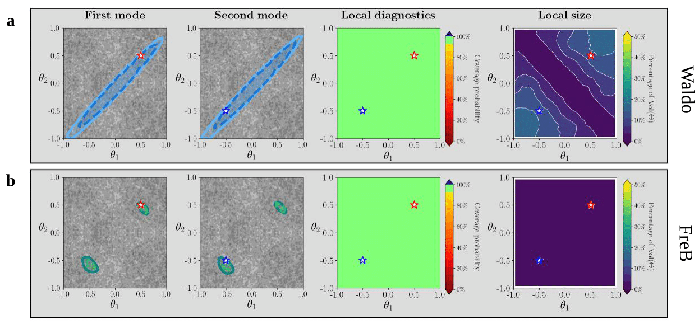
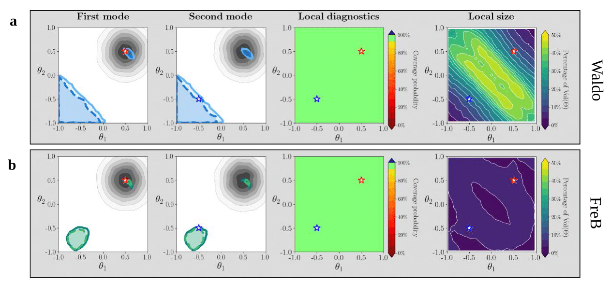

# Supplement on Waldo vs FreB

We provide an empirical demonstration of the implication of Theorem 6—that the confidence sets produced by the FreB framework are, **on average over the target population**, the smallest among all locally valid confidence procedures. To emphasize this point, we compare FreB with another likelihood-free confidence procedure, **Waldo** [[1](#ref1)], on the classic *Two Moons* task.

For this task, data are generated from a bimodal likelihood of the form

$$
p(X\mid\theta) =
\begin{pmatrix}
r~\cos(\alpha) + 0.25\\
r~\sin(\alpha)
\end{pmatrix}
+
\begin{pmatrix}
-\lvert \theta_1 + \theta_2 \rvert / \sqrt{2} \\
(-\theta_1 + \theta_2)/\sqrt{2}
\end{pmatrix},
$$

with $$\alpha\sim\mathcal{U}(-\pi/2,\pi/2)$$ and $$r\sim\mathcal{N}(0.1,0.01^2)$$.

We study the comparative performance of **Waldo** and **FreB** under two priors:

1. a uniform prior on $$\Theta=[-1,1]^2$$, and
2. a strong Gaussian prior.

In each case, we use a flow-matching posterior estimator from the **SBI** library [[2](#ref2)], using default hyperparameters. We generate one observation from each mode of the likelihood:

$$
X_{1,\text{target}} \sim p(X\mid\theta^\star = [-0.5,-0.5])\text{, and}
$$

$$
X_{2,\text{target}} \sim p(X\mid\theta^\star = [0.5,0.5]).
$$

As in our other examples, we assume only a single sample to infer $$\theta^\star$$, i.e., $$n=1$$.

**Experimental setup (common across prior settings):**

1. **Training set:** Construct $$T_{tr} = \{(\theta_i, X_i)\}_{i=1}^B \sim p(X\vert\theta)\pi(\theta)$$ with $$B=50{,}000$$ and $$\pi(\theta)=\mathcal{N}([0.5,0.5]^T, 0.5I)$$ to learn $$\hat{\pi}(\theta\mid X)$$ via flow matching [[3](#ref3)].

2. **Calibration set:** Construct $$T_{calib} = \{(\theta_i, X_i)\}_{i=1}^{B'} \sim p(X\vert\theta) r(\theta)$$ with $$B'=50{,}000$$ and $$r(\theta)=\mathcal{U}([-1,1]^2)$$, and estimate critical values via quantile regression using **CatBoost** [[4](#ref4)].

3. **Diagnostic set / local size estimation:** Construct $$T_{diagn} = \{(\theta_i, X_i)\}_{i=1}^{B''} \sim p(X\vert\theta) r(\theta)$$, with $$B''=10{,}000$$ and $$r(\theta)=\mathcal{U}([-1,1]^2)$$. A probabilistic classifier is then trained using **CatBoost** to estimate both coverage probability and local set size.

---

## Case 1: Uniform Prior

Figure 1 shows results under the uniform prior. The primary factor influencing the size of **Waldo**'s confidence sets is their dependence on the posterior variance. Because the posterior is bimodal, this variance is globally large, even though each mode is individually sharp. FreB, on the other hand, preserves the posterior multimodality while maintaining valid coverage on each mode without merging them.

**Figure 1—FreB confidence sets are precise (uniform prior).**
With the two-moons task, FreB (Panel b) yields substantially more precise confidence sets than **Waldo** (Panel a), which tends to merge the two modes and become conservative as a result.

---

## Case 2: Strong Prior

Figure 2 displays results under the strong prior. Both FreB and Waldo maintain local coverage despite being trained under a strongly informative prior. In this case, Waldo's confidence sets can also be multimodal (see Panel a), but they are less constrained beyond the prior support than FreB's. This behavior may arise because Waldo's test statistic depends more heavily on the posterior estimator's variance than the posterior density itself.

**Figure 2—FreB confidence sets are precise (strong prior).**
Under the strong prior, FreB (Panel b) again provides tighter confidence sets than Waldo (Panel a).
 
---

## References

**[1]** Masserano, L., Dorigo, T., Izbicki, R., Kuusela, M., & Lee, A. (2023). Simulator-Based Inference with WALDO: Confidence Regions by Leveraging Prediction Algorithms and Posterior Estimators for Inverse Problems. In F. Ruiz, J. Dy, & J.-W. van de Meent (Eds.), *Proceedings of The 26th International Conference on Artificial Intelligence and Statistics*, *206* (pp. 2960–2974). PMLR. [https://proceedings.mlr.press/v206/masserano23a.html](https://proceedings.mlr.press/v206/masserano23a.html)

**[2]** Tejero-Cantero, A., Boelts, J., Deistler, M., Lueckmann, J.-M., Durkan, C., Gonçalves, P. J., Greenberg, D. S., & Macke, J. H. (2020). sbi: A toolkit for simulation-based inference. *Journal of Open Source Software*, *5*(52), 2505. [https://doi.org/10.21105/joss.02505](https://doi.org/10.21105/joss.02505)

**[3]** Wildberger, J., Dax, M., Buchholz, S., Green, S., Macke, J. H., & Schölkopf, B. (2023). Flow Matching for Scalable Simulation-Based Inference. In A. Oh, T. Naumann, A. Globerson, K. Saenko, M. Hardt, & S. Levine (Eds.), *Advances in Neural Information Processing Systems 36* (pp. 16837–16864). Curran Associates, Inc. [https://proceedings.neurips.cc/paper_files/paper/2023/file/3663ae53ec078860bb0b9c6606e092a0-Paper-Conference.pdf](https://proceedings.neurips.cc/paper_files/paper/2023/file/3663ae53ec078860bb0b9c6606e092a0-Paper-Conference.pdf)

**[4]** Prokhorenkova, L., Gusev, G., Vorobev, A., Dorogush, A. V., & Gulin, A. (2018). CatBoost: unbiased boosting with categorical features. *Advances in Neural Information Processing Systems*, *31*.