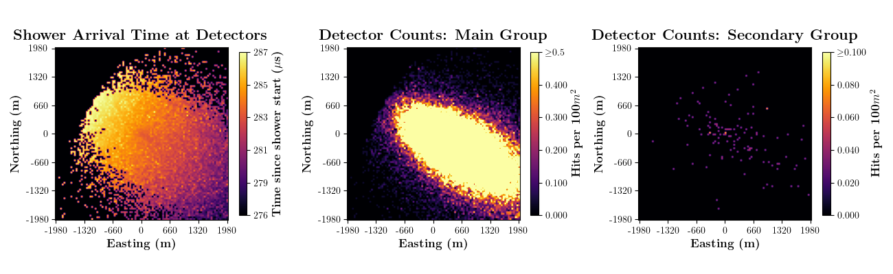
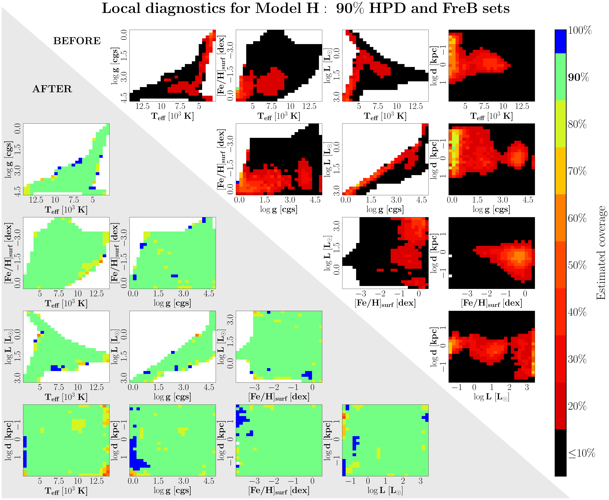
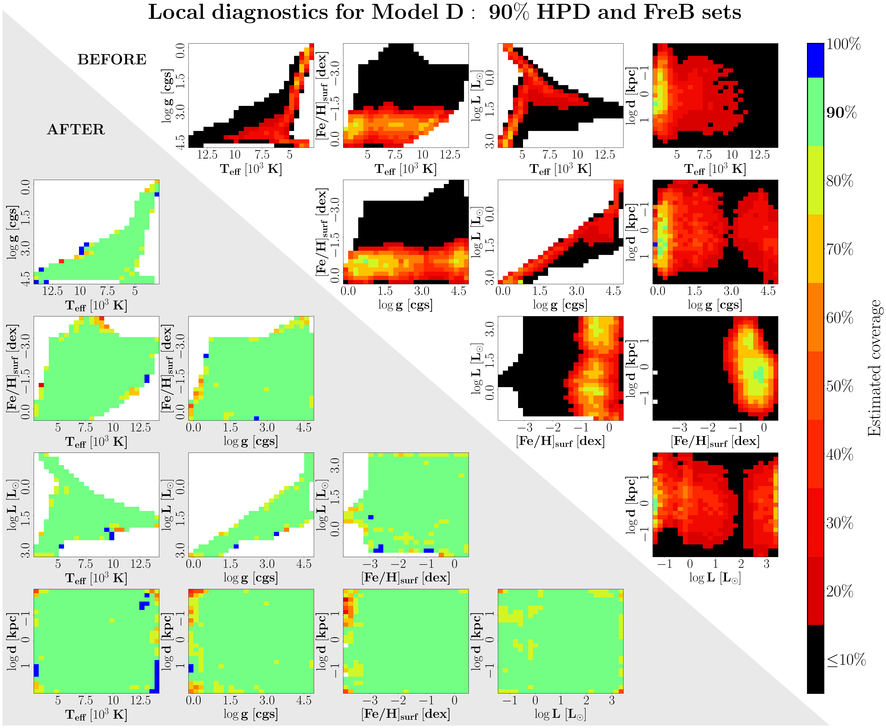
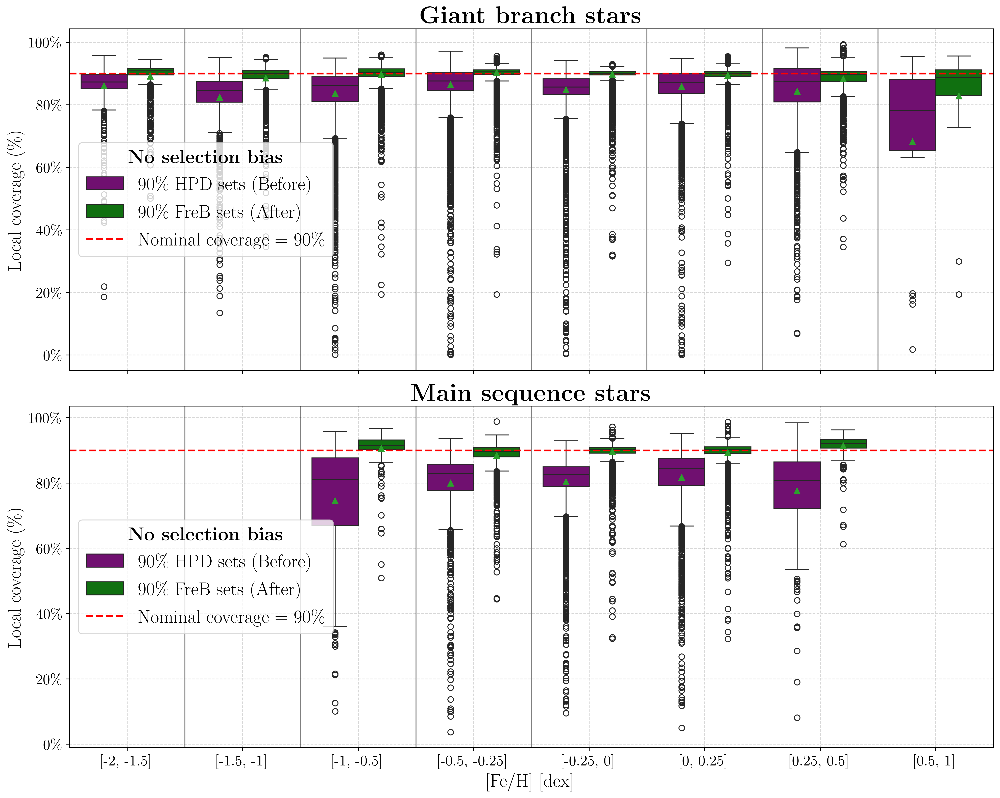
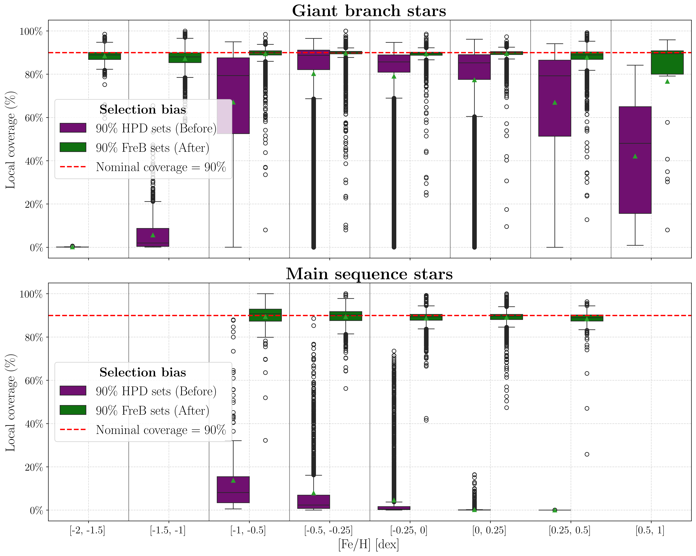

# Supplementary figures

## Figure S1: Example features collected for a single gamma-ray event

**Figure S1: Example features collected for a single gamma-ray event.** For each detector (represented by the pixels in each figure), we plot three measurements of the induced atmospheric shower. *Left:* Average arrival time of secondary shower particles. *Center:* Number of detections of "main" shower particles (photons, electrons, and positrons). *Right:* Number of detections of "secondary" shower particles (muons, all other possible shower particles).

---

## Figure S2: Local diagnostics for Model H

**Figure S2: Local diagnostics for Model H.** *Upper right triangle:* the average coverage probability of a 90% HPD credible set is often found to severely undercover. *Lower left triangle:* After reshaping the posterior, the coverage probability of a 90% FreB confidence set is in general closer to the nominal value.

---

## Figure S3: Local diagnostics for Model D

**Figure S3: Local diagnostics for Model D.** *Upper right triangle:* As with Figure S2, the average coverage probability of a 90% HPD credible set is still far below 90%. *Lower left triangle:* The coverage probability of a 90% FreB confidence set is close to the nominal value.

---

## Figure S4: Local diagnostics by metallicity (no selection bias)

**Figure S4: Local diagnostics by metallicity in the no selection bias setting.** Boxplots of the estimated coverage of target data (see main text Figure 3b). HPD sets undercover for, for example, metal-poor GB stars (*top panel*) with metallicity around $$[Fe/H]=-1.0$$ dex as well as for MS stars (*bottom panel*), with the actual chance of including the true parameter values often being closer to 80%. After adjusting the posteriors, the coverage probability of FreB sets is close to the nominal 90% value for all stars.

---

## Figure S5: Local diagnostics by metallicity (selection bias)

**Figure S5: Local diagnostics by metallicity in the selection bias setting.** Boxplots of the estimated coverage of target data (see main text Figure 3c). HPD sets severely undercover for, for example, metal-poor GB stars (*top panel*) as well as for MS stars (*bottom panel*), with the chance of including the true parameter values sometimes being close to 0%. After adjusting the posteriors, the coverage probability of FreB sets is close to the nominal 90% value for all stars.